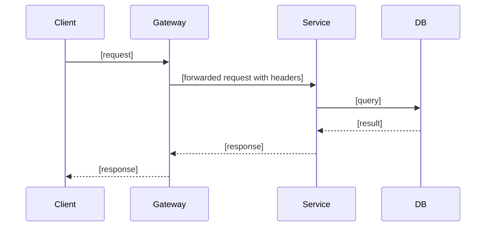

# Architecture Design: [Feature Name]

**Author:** [backend-architect / frontend-architect]
**Date:** [YYYY-MM-DD]
**Requirement Ref:** `.claude/docs/requirements/[feature]-requirement.md`

---

## Backend Design

### API Contract

#### [METHOD /path]
- **Controller:** `com.e_commerce.[service].controller.[admin|customer].[ControllerName]`
- **Auth:** `@PreAuthorize("hasRole('[ROLE]')")`
- **Request DTO:** `[DtoName]` in `model/dto/[domain]/`
- **Response DTO:** `[DtoName]` in `model/dto/[domain]/`
- **Status Codes:** 200 / 201 / 204 / 400 / 404 / 409

### Database Schema

**Service:** [serviceName]
**Changelog:** `NNN-[description].yaml`

```yaml
# Table structure
tableName: [table_name]
columns:
  - id: uuid (PK)
  - [column]: [type]
  - created_at: timestamp (from AuditEntity)
  - updated_at: timestamp (from AuditEntity)

indexes:
  - idx_[table]_[column]: [column(s)]

foreignKeys:
  - fk_[table]_[ref]: [column] -> [ref_table].[ref_column]
```

### Entity Class

- **Package:** `com.e_commerce.[service].model`
- **Extends:** `AuditEntity`
- **Annotations:** `@Entity`, `@Table(name = "[table]")`, `@Data`, `@Builder`, `@AllArgsConstructor`, `@NoArgsConstructor`

### Repository

- **Interface:** `I[Name]Repository extends JpaRepository<[Entity], UUID>`
- **Custom queries:** [List any @Query methods needed]

### Service Layer

- **Interface:** `I[Name]Service` in `service/`
- **Implementation:** `[Name]Service` in `service/impl/`
- **Dependencies:** [List injected services/repos]

### Kafka Events (if applicable)

| Topic | Event Class | Producer Service | Consumer Service | Consumer Group |
|-------|-------------|-----------------|-----------------|----------------|
| [topic-name] | [EventClass] | [service] | [service] | [service]-service-group |

**New Constants.java entry:**
```java
public static final String [TOPIC_CONSTANT] = "[topic-name]";
```

### Feign Client Changes (if applicable)

- **Client:** `I[Service]Client` in `[callerService]/client/`
- **Target:** `[targetService]` on port `[port]`
- **New method:** `[method signature]`

### Sequence Diagram



---

## Frontend Design

### Route Structure

```
src/app/
  ([route-group])/
    [feature]/
      page.tsx           — Main page (Server Component)
      loading.tsx        — Loading state
      (components)/
        [Component].tsx  — Page-specific components
      actions.ts         — Server actions
```

### Component Breakdown

| Component | Type | Location | Props |
|-----------|------|----------|-------|
| [Name] | Server/Client | src/(components)/ or page (components)/ | [key props] |

### State Management (Zustand)

**Store:** `src/utils/store/[feature].ts`

```typescript
interface [Feature]State {
  // State
  items: [Type][];
  // Actions (nested in actions object)
  actions: {
    fetch[Items]: () => Promise<void>;
    add[Item]: (id: string) => Promise<void>;
    remove[Item]: (id: string) => Promise<void>;
  };
}
```

**Persist config:** `partialize` with fields: [list persisted fields]

### Data Fetching

| Endpoint | Fetch Method | Where Used |
|----------|-------------|------------|
| [endpoint] | apiFetch / serverApiFetch | [component/action] |

### Types

**Add to `src/constants/types.ts`:**
```typescript
interface [TypeName] {
  // fields
}
```

---

## Common Module Changes (if any)

- [ ] New event class in `com.e_commerce.common.model.event`
- [ ] New constant in `Constants.java`
- [ ] New shared DTO
- [ ] Requires `cd backend/common && mvn clean install`

## Checklist

- [ ] Architecture aligns with requirement doc
- [ ] All existing patterns followed (verify against skills)
- [ ] No unnecessary coupling between services
- [ ] Security model maintained (RBAC, header propagation)
- [ ] Performance considerations documented
