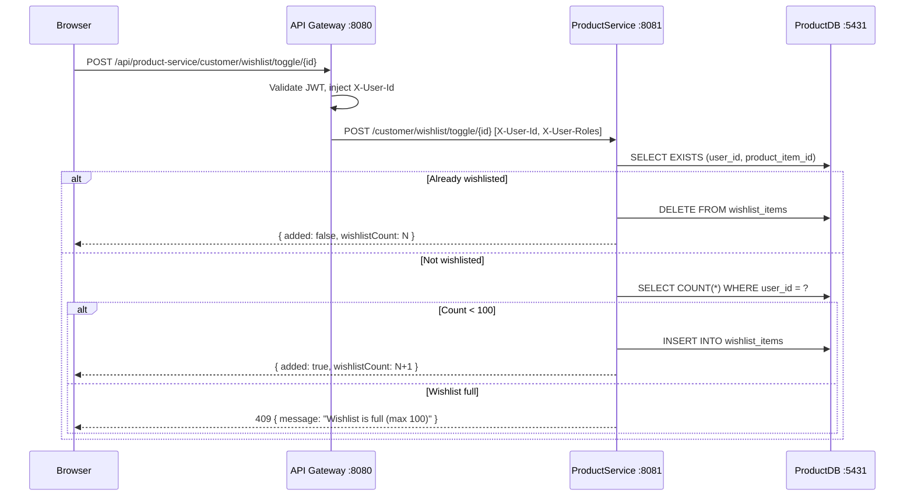

# Architecture Design: Wishlist

**Author:** backend-architect + frontend-architect
**Date:** 2026-06-18
**Requirement Ref:** `.claude/docs/requirements/example-wishlist-requirement.md`

---

## Backend Design

### API Contract

#### POST /customer/wishlist/toggle/{productItemId}
- **Controller:** `com.e_commerce.productService.controller.customer.CustomerWishlistController`
- **Auth:** Authenticated via `GatewayHeaderAuthenticationFilter` (X-User-Id)
- **Request DTO:** None (path variable)
- **Response DTO:** `WishlistToggleResponseDTO` in `model/dto/wishlist/`
- **Status Codes:** 200 (toggled), 404 (product item not found), 409 (wishlist full)

#### GET /customer/wishlist
- **Controller:** `com.e_commerce.productService.controller.customer.CustomerWishlistController`
- **Auth:** Authenticated
- **Response DTO:** `WishlistResponseDTO` with `List<WishlistItemDTO>`

#### DELETE /customer/wishlist/{wishlistItemId}
- **Controller:** Same controller
- **Auth:** Authenticated
- **Status Codes:** 204

#### GET /customer/wishlist/check/{productItemId}
- **Controller:** Same controller
- **Auth:** Authenticated
- **Response DTO:** `WishlistCheckResponseDTO`

### Database Schema

**Service:** productService (port 5431)
**Changelog:** `012-create-wishlist-items.yaml`

```yaml
tableName: wishlist_items
columns:
  - id: uuid (PK)
  - user_id: varchar(255) (NOT NULL) — from X-User-Id header
  - product_item_id: uuid (NOT NULL, FK -> product_items.id)
  - created_at: timestamp (from AuditEntity)
  - updated_at: timestamp (from AuditEntity)

indexes:
  - idx_wishlist_user_id: user_id
  - idx_wishlist_user_product: user_id, product_item_id (UNIQUE)

foreignKeys:
  - fk_wishlist_product_item: product_item_id -> product_items.id
```

### Entity Class

- **Package:** `com.e_commerce.productService.model`
- **Class:** `WishlistItem`
- **Extends:** `AuditEntity`
- **Fields:** `id` (UUID), `userId` (String), `productItem` (ManyToOne -> ProductItem)

### Repository

- **Interface:** `IWishlistItemRepository extends JpaRepository<WishlistItem, UUID>`
- **Custom queries:**
  - `findByUserIdAndProductItem_Id(String userId, UUID productItemId)` → Optional
  - `findAllByUserIdOrderByCreatedAtDesc(String userId)` → List
  - `countByUserId(String userId)` → long
  - `existsByUserIdAndProductItem_Id(String userId, UUID productItemId)` → boolean

### Service Layer

- **Interface:** `IWishlistService` in `service/`
- **Implementation:** `WishlistService` in `service/impl/`
- **Dependencies:** `IWishlistItemRepository`, `IProductItemRepository`
- **Key logic:**
  - `toggleWishlist`: Check exists → delete if yes, create if no. Check count < 100 before adding.
  - `getWishlist`: Fetch all items with product details (join fetch to avoid N+1)
  - `isWishlisted`: Simple exists check (fast, < 50ms)

### DTOs

```
model/dto/wishlist/
  ├── WishlistToggleResponseDTO.java    — { added: boolean, wishlistCount: long }
  ├── WishlistItemDTO.java              — { id, productItemId, productName, productImage, price, originalPrice, inStock, addedAt }
  ├── WishlistResponseDTO.java          — { items: List<WishlistItemDTO>, totalCount: int }
  └── WishlistCheckResponseDTO.java     — { isWishlisted: boolean }
```

### Kafka Events

None for MVP. Wishlist is purely synchronous.

### Sequence Diagram



---

## Frontend Design

### Route Structure

```
src/app/
  (customer)/
    wishlist/
      page.tsx              — Wishlist page (Server Component, fetches initial data)
      loading.tsx           — Shimmer/skeleton loading
      (components)/
        WishlistGrid.tsx    — Grid layout for wishlist cards (Client)
        WishlistCard.tsx    — Individual card with actions (Client)
        EmptyWishlist.tsx   — Empty state illustration + CTA (Server)
      actions.ts            — Server actions (getWishlistAction, toggleWishlistAction)
```

### Component Breakdown

| Component | Type | Location | Key Props |
|-----------|------|----------|-----------|
| WishlistGrid | Client | wishlist/(components)/ | `initialItems: WishlistItemDTO[]` |
| WishlistCard | Client | wishlist/(components)/ | `item: WishlistItemDTO`, `onRemove`, `onMoveToCart` |
| EmptyWishlist | Server | wishlist/(components)/ | None |
| WishlistButton | Client | src/(components)/wishlistButton/ | `productItemId: string`, `initialWishlisted?: boolean` |

**WishlistButton** is a new shared component — a heart icon toggle used on PDP and PLP cards.

### State Management (Zustand)

**Store:** `src/utils/store/wishlist.ts`

```typescript
interface WishlistState {
  wishlistIds: Set<string>;  // Set of product item IDs for fast lookup
  wishlistCount: number;
  actions: {
    toggleWishlist: (productItemId: string) => Promise<boolean>;
    checkWishlisted: (productItemId: string) => boolean;  // local check from Set
    fetchWishlistIds: () => Promise<void>;  // load all IDs on app init
    clearWishlistData: () => void;
  };
}
```

**Persist config:** `partialize: (state) => ({ wishlistIds: [...state.wishlistIds], wishlistCount: state.wishlistCount })`

### Data Fetching

| Endpoint | Fetch Method | Where Used |
|----------|-------------|------------|
| GET /product-service/customer/wishlist | serverApiFetch | wishlist/actions.ts (SSR) |
| POST /product-service/customer/wishlist/toggle/{id} | apiFetch | wishlistStore.toggleWishlist |
| GET /product-service/customer/wishlist/check/{id} | apiFetch | WishlistButton (on mount, if not in store) |
| DELETE /product-service/customer/wishlist/{id} | apiFetch | WishlistCard.onRemove |

### Types

**Add to `src/constants/types.ts`:**
```typescript
interface WishlistItemDTO {
  id: string;
  productItemId: string;
  productName: string;
  productImage: string;
  price: number;
  originalPrice: number;
  inStock: boolean;
  addedAt: string;
}

interface WishlistToggleResponse {
  added: boolean;
  wishlistCount: number;
}

interface WishlistCheckResponse {
  isWishlisted: boolean;
}
```

---

## Common Module Changes

- None required for MVP.

## Checklist

- [x] Architecture aligns with requirement doc
- [x] Package follows `com.e_commerce.productService` convention
- [x] Repository uses `I[Name]Repository extends JpaRepository<Entity, UUID>`
- [x] Service uses `I[Name]Service` + `[Name]Service` in `impl/`
- [x] Controller under `customer/` (not admin)
- [x] Entity extends `AuditEntity`
- [x] Liquibase YAML with next sequential number (012)
- [x] Frontend route in `(customer)` group
- [x] Zustand store follows persist + nested actions pattern
- [x] Uses `apiFetch` for client, `serverApiFetch` for server actions
- [x] Performance: wishlist check is O(1) from local Zustand Set
