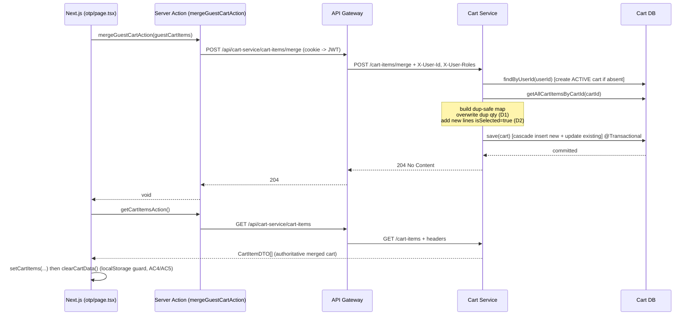

# Architecture Design: Guest Cart Merge on Login

**Feature ID:** FEA001
**Authors:** backend-architect, frontend-architect (orchestrator pipeline)
**Date:** 2026-06-18
**Stage:** 3 (DESIGN)
**Requirement Ref:** `.claude/docs/requirements/guest-cart-merge-requirement.md`
**Sprint Plan Ref:** `.claude/docs/plans/guest-cart-merge-sprint-plan.md`
**GitHub Issue:** #24
**Plan Branch:** `FEA001-guest-cart-merge/plan`

---

## 0. Confirmed Decisions Driving This Design

- **D1 (Duplicates):** When a `productItemId` exists in both guest and server cart, the **guest quantity overwrites** the server quantity (`quantity` AND `updatedQuantity`). User's latest intent wins.
- **D2 (isSelected):** New guest lines -> `isSelected = true`. Existing server lines -> **retain** their current `isSelected` state. `priceSnapshot` retained from server for existing lines; guest `priceSnapshot` used for new lines.
- **D3 (Merge timing):** Merge fires immediately after OTP verification in `otp/page.tsx`, for **both** the first-time-login (`/setup-account`) path and the normal-redirect path.

## 0.1 ADR / Pattern Compliance

- **ADR-001 (Kafka choreography):** Not affected. This feature is a synchronous REST call within the Cart Service; it does not participate in the order-fulfillment event flow. No new Kafka topics or events.
- **No common-module change.** `CartItemRequestDTO` already carries all required fields (`productItemId`, `quantity`, `priceSnapshot`, `isSelected`). No shared DTO/event/Constant added; therefore **no `mvn clean install` of `common` is required**.
- **No Liquibase/schema change.** The `cart_items` table already supports everything the merge needs.
- **No API Gateway change.** Route `/api/cart-service/**` (StripPrefix=2) already proxies all `/cart-items/*` endpoints, injecting `X-User-Id`/`X-User-Roles`.

---

# PART A — BACKEND DESIGN (Cart Service, port 8082)

## A.1 API Contract

### `POST /cart-items/merge`

- **Controller:** `com.e_commerce.cartService.controller.CartItemController`
- **Gateway path (frontend-facing):** `POST /api/cart-service/cart-items/merge`
- **Auth:** Authenticated. User resolved from `authentication.getName()` which is the gateway-injected `X-User-Id` (via `GatewayHeaderAuthenticationFilter` in common). **No `userId` is read from the body** (AC7). No `@PreAuthorize` role gate is used — consistent with the existing cart endpoints (`/add`, `/update`, etc.), which only require an authenticated principal.
- **Request body:** `List<CartItemRequestDTO>` (the guest cart). Validated with `@Valid` (element-level `@NotNull productItemId`, `@Min(1) quantity`, `@NotNull priceSnapshot`).
- **Response:** `204 No Content` (mirrors `/add`, `/update`, `/update-all`). The frontend re-fetches the authoritative cart via the existing `GET /cart-items` after merge, so the merge response carries no body.
- **Status codes:**
  - `204` — merge applied (or no-op for empty body).
  - `400` — validation failure on a request element (e.g. missing `productItemId`, `quantity < 1`).
  - `401` — missing/invalid auth context (gateway rejects before reaching the service).

#### Request schema (`CartItemRequestDTO`, reused as-is)

```jsonc
[
  {
    "productItemId": "uuid",     // @NotNull
    "quantity": 2,                // @Min(1)
    "priceSnapshot": 1299.00,     // @NotNull, BigDecimal(10,2)
    "isSelected": true            // nullable; ignored for existing lines (D2)
  }
]
```

#### Controller method (design)

```java
@PostMapping("/merge")
public ResponseEntity<Void> mergeGuestCart(
        @Valid @RequestBody List<CartItemRequestDTO> guestItems,
        Authentication authentication) {
    cartItemService.mergeGuestCart(guestItems, authentication.getName());
    return ResponseEntity.noContent().build();
}
```

> Note: `@Valid` on a `List<T>` parameter validates each element when the controller class is a bean (Spring validates collection elements of `@RequestBody List<@Valid ...>`). To be robust across Spring versions, the DTO's bean-validation annotations on `CartItemRequestDTO` are what enforce element validity; the implementation must still defensively handle `null`/empty.

## A.2 Service Interface Change

- **File:** `service/ICartItemService.java`
- **Add:**

```java
void mergeGuestCart(List<CartItemRequestDTO> guestItems, String userId);
```

`void` return is intentional and consistent with `addItemInCart` / `updateAllItemInCart`. The frontend reads the merged result through the existing `getCartItems` endpoint.

## A.3 Service Implementation — Merge Algorithm

- **File:** `service/impl/CartItemServiceImpl.java`
- **Transaction:** annotate with `@Transactional` (use `jakarta.transaction.Transactional`, consistent with `addItemInCart`, `updateItemInCart`, `updateAllItemInCart` in this class) — satisfies **AC8 (atomicity)**.
- **Reused collaborators:** `cartRepository.findByUserId`, `cartItemRepository.getAllCartItemsByCartId`, `cartRepository.save` (cascade persists new `CartItem`s via `Cart.items` with `CascadeType.ALL`), and optionally `cartItemRepository.saveAll`.

### Algorithm (pseudocode)

```
mergeGuestCart(guestItems, userId):
    1. if guestItems is null OR empty:           # AC6 empty guest cart no-op
           return

    2. cart = cartRepository.findByUserId(userId)
              .orElseGet(create ACTIVE cart with empty items list)   # mirror addItemInCart

    3. existing = cartItemRepository.getAllCartItemsByCartId(cart.getId())
       # Build map keyed by productItemId. Guard against pre-existing duplicate
       # rows (R2) by using a merge function that keeps the FIRST occurrence,
       # NOT Collectors.toMap(k, v) which throws IllegalStateException on dup keys.
       byProductItem = existing.stream().collect(
           Collectors.toMap(CartItem::getProductItemId,
                            ci -> ci,
                            (a, b) -> a))                            # keep first

    4. newItems = []
       for g in guestItems:
           CartItem match = byProductItem.get(g.getProductItemId())
           if match != null:                                        # duplicate -> D1
               match.setQuantity(g.getQuantity())
               match.setUpdatedQuantity(g.getQuantity())
               # D2: do NOT touch match.isSelected, do NOT touch match.priceSnapshot
           else:                                                    # new -> AC2 / D2
               CartItem item = CartItem.builder()
                   .productItemId(g.getProductItemId())
                   .quantity(g.getQuantity())
                   .updatedQuantity(g.getQuantity())
                   .priceSnapshot(g.getPriceSnapshot())             # guest snapshot for new
                   .isSelected(true)                                # D2
                   .cart(cart)
                   .build()
               cart.getItems().add(item)
               byProductItem.put(g.getProductItemId(), item)        # dedupe within guest payload too

    5. cartRepository.save(cart)     # cascade persists new items + dirty-checks updated ones
       # (existing managed entities mutated in step 4 are flushed within the tx;
       #  cartItemRepository.saveAll(existing) may be added for explicitness)
```

### Behavior mapping to ACs

| Step | AC / Decision |
|------|---------------|
| 1 | AC6 (empty no-op) |
| 2 | AC2 first-time user (creates cart on demand) |
| 3 | AC1 (existing items loaded, never deleted) + R2 mitigation (dup-safe map) |
| 4-duplicate | AC3 / D1 (overwrite qty) + D2 (retain isSelected & priceSnapshot) |
| 4-new | AC2 (add) + D2 (isSelected=true, guest priceSnapshot) |
| 4 dedupe-within-payload | AC5 (re-applying a guest payload containing repeats does not create dup rows) |
| 5 + `@Transactional` | AC8 (atomic) |

### Idempotency note (AC5)

Because D1 uses **overwrite** (not sum), re-sending the same guest payload is naturally idempotent at the data level: the second call sets `quantity` to the same value. Combined with the frontend clearing `localStorage` after a successful merge (primary guard, FE-3), AC5 holds. No DB-level idempotency key is required.

### Edge cases the implementation must handle

- **Null/empty body** -> early return (AC6).
- **Pre-existing duplicate `productItemId` rows** in the server cart -> map merge-function keeps the first; the kept row is updated, the orphan duplicate is left untouched (merge must not throw). Documented as known limitation; cleanup of legacy duplicates is out of scope.
- **Repeated `productItemId` within the guest payload** -> handled by `byProductItem.put(...)` after creating a new item, so the second occurrence updates the just-created line instead of inserting a second row.
- **`isSelected == null` on a new guest item** -> forced to `true` per D2 (we do not pass through the nullable guest value for new lines).

## A.4 Repository

No new repository methods. Reuses:
- `cartRepository.findByUserId(String)` (existing)
- `cartRepository.save(Cart)` (JpaRepository)
- `cartItemRepository.getAllCartItemsByCartId(UUID)` (existing native query)
- optionally `cartItemRepository.saveAll(Iterable)` (JpaRepository)

## A.5 Entity / DB

No changes. `cart_items`: `product_item_id`, `quantity`, `updated_quantity`, `price_snapshot`, `is_selected`, `cart_id` (FK), audit columns. `Cart.items` is `@OneToMany(cascade = ALL, orphanRemoval = true)` — new items added to the in-memory list are persisted by `cartRepository.save(cart)`.

## A.6 Sequence Diagram



## A.7 Backend Test Plan (BE-4)

Service-level test (`CartItemServiceImplTest`) with mocked repositories, plus optional controller slice test. Cases:

1. **AC6** — empty/null `guestItems` -> no repo writes, no exception.
2. **AC2** — new `productItemId` -> new `CartItem` added with `isSelected=true`, `updatedQuantity=quantity`, guest `priceSnapshot`.
3. **AC3 / D1 / D2** — `productItemId` present on server -> `quantity` and `updatedQuantity` overwritten with guest qty; `isSelected` and `priceSnapshot` unchanged.
4. **AC1** — server items NOT in the guest payload remain untouched (no delete).
5. **AC5** — re-running merge with same payload leaves quantities equal (overwrite, not sum) and creates no new rows.
6. **AC2 first-time user** — `findByUserId` empty -> ACTIVE cart created and saved.
7. **R2** — server cart with two rows of the same `productItemId` -> merge does not throw; first row updated.

---

# PART B — FRONTEND DESIGN (Next.js)

## B.1 Server Action — `mergeGuestCartAction`

- **File:** `src/app/(customer-checkout)/checkout/cartActions.ts`
- **Add:**

```typescript
export async function mergeGuestCartAction(items: CartItemDTO[]) {
  // Map the persisted Zustand cart shape -> backend CartItemRequestDTO shape.
  const payload = items.map((ci) => ({
    productItemId: ci.productItemId,
    quantity: ci.quantity,
    priceSnapshot: ci.priceSnapshot,
    isSelected: ci.isSelected ?? true,
  }));
  await serverApiFetch<void>("/cart-service/cart-items/merge", {
    method: "POST",
    body: payload,
  });
}
```

- **Contract mapping (verified against `CartItemRequestDTO` + `CartItemDTO`):**

  | Backend `CartItemRequestDTO` | Frontend `CartItemDTO` | Notes |
  |------------------------------|------------------------|-------|
  | `productItemId: UUID @NotNull` | `productItemId: string` | direct |
  | `quantity: Integer @Min(1)` | `quantity: number` | must be >= 1; guest lines always >= 1 |
  | `priceSnapshot: BigDecimal @NotNull` | `priceSnapshot: number` | direct; serialized as number |
  | `isSelected: Boolean (nullable)` | `isSelected?: boolean` | default `true`; ignored by backend for existing lines (D2) |

  We intentionally do **not** send `updatedQuantity` (not part of `CartItemRequestDTO`).

- **Auth:** `serverApiFetch` injects the auth cookie; the gateway converts it to `X-User-Id`. No userId is sent in the body (AC7). The action is a Server Action so it runs after the auth cookie is set by `verify-otp`.

## B.2 Trigger Point — `otp/page.tsx`

- **File:** `src/app/(authentication)/otp/page.tsx`
- **Where:** inside `handleOtpScreenClick`, **after** `setAccess(access)` / `setUserInfo(userInfo)` succeed and **before** `router.push(...)`, for BOTH branches (`firstTimeLogin -> /setup-account` and normal redirect) — satisfies **D3**.

- **Design (revised handler tail):**

```typescript
setFirstTimeLogin(firstTimeLogin);
setAccess(access);
setUserInfo(userInfo);

// --- Guest cart merge (FEA001) ---
await mergeGuestCartOnLogin();   // helper below; non-blocking on failure

notify({ variant: 'success', title: 'Success!', message: 'OTP verified successfully.' });

if (firstTimeLogin)
  router.push(`/setup-account?redirectUrl=${encodeURIComponent(redirecturl)}`);
else
  router.push(redirecturl.split(window.location.hostname)[1]);
```

- **Helper (in the component, using the cart store):**

```typescript
const mergeGuestCartOnLogin = async () => {
  // read persisted guest cart directly from the store (not a hook, to avoid re-render coupling)
  const guestItems = useCartStore.getState().cartItems;
  if (!guestItems || guestItems.length === 0) return;          // AC6
  try {
    await mergeGuestCartAction(guestItems);                    // POST /merge
    const serverItems = await getCartItemsAction();            // authoritative cart
    setCartItems(serverItems ?? []);                           // refresh store
    clearCartData();                                           // clears cartItems + coupon (AC4/AC5 guard)
    // NOTE: clearCartData() resets cartItems to []; re-setting from server then clearing
    // would wipe the merged view. See B.3 for the correct ordering.
  } catch (err) {
    notify({
      variant: 'error',
      title: 'Cart sync failed',
      message: 'We could not sync your cart. Your saved items are still on this device.',
    });
    // do NOT rethrow — login must not be blocked by a merge failure (D3/R3)
  }
};
```

- **Why `await` (not fire-and-forget):** awaiting before navigation guarantees the merge completes while the auth cookie context is alive and avoids a navigation race for the first-time `/setup-account` path (R3). The `try/catch` ensures a merge failure never blocks login.

> **Store access note:** `otp/page.tsx` must import `useCartActions` (for `setCartItems`, `clearCartData`) at the top of the component, and read the current persisted items via `useCartStore.getState().cartItems` at call time (so we capture the latest persisted guest cart rather than a stale render snapshot). `useCartStore` is currently module-private in `cart.ts`; see B.3 for the small export needed.

## B.3 Store Refresh + localStorage Clear (ordering correctness)

- **Files:** `src/app/(authentication)/otp/page.tsx`; small additive change in `src/utils/store/cart.ts`.

- **Required ordering (corrects the comment in B.2):**
  1. `await mergeGuestCartAction(guestItems)` — server now holds the merged cart.
  2. `clearCartData()` — clears the persisted guest cart in `localStorage`/store (primary idempotency guard, AC5). This must run **before** we set the server items, OR we set server items as the final step. To avoid ambiguity the implementation MUST do:
     - `const serverItems = await getCartItemsAction();`
     - `setCartItems(serverItems ?? []);`  ← final authoritative state shown to the user (AC4 refresh).
  3. Because `setCartItems` is the last write, the persisted `cartItems` ends as the server-authoritative list, and the original guest-only entries are gone. The "clear" intent (removing guest-only local state) is achieved by replacing with the server list; an explicit `clearCartData()` of coupon/donation is optional and out of scope (only `cartItems` is in scope per requirement section 4).

  **Canonical final implementation order (use this):**
  ```
  await mergeGuestCartAction(guestItems);
  const serverItems = await getCartItemsAction();
  setCartItems(serverItems ?? []);   // replaces guest cart with merged server cart (AC4)
  ```
  This single sequence satisfies AC4 (clear guest cart + refresh from server) and AC5 (subsequent login finds local cart already equal to server, so merge is a no-op or harmless overwrite).

- **Additive change to `cart.ts`:** export the raw store so `getState()` can be read outside React render, OR add a small selector-free helper. Minimal, non-breaking option:

  ```typescript
  // cart.ts — add named export (the store is currently module-private)
  export { useCartStore };
  ```

  Alternatively expose a helper action `getGuestCartSnapshot()` if the team prefers not to export the raw store. Either is acceptable; exporting `useCartStore` is the smaller change and is the recommended approach.

- **One-shot guard (optional, defense-in-depth for R1):** a module-level `let mergeInFlight = false;` in `otp/page.tsx` set true before merge and reset in `finally`, to prevent double-submit re-entry. Not strictly required because the overwrite semantics (D1) make re-merge harmless, but recommended.

## B.4 Types

No new types required. Reuses `CartItemDTO` (`src/constants/types.ts`) for the store payload and the action input. The action maps to the backend's `CartItemRequestDTO` shape inline (B.1) — no exported TS interface needed, but a small `MergeCartItemRequest` type may be added for clarity:

```typescript
// optional, src/constants/types.ts
export interface MergeCartItemRequest {
  productItemId: string;
  quantity: number;
  priceSnapshot: number;
  isSelected?: boolean;
}
```

## B.5 Frontend Verification (FE-4)

- `cd frontend/ecommerce && npm run lint` clean for changed files.
- `cd frontend/ecommerce && npm run build` succeeds.

---

# PART C — CROSS-CUTTING

## C.1 Contract Agreement (BE <-> FE)

| Item | Value |
|------|-------|
| Method + path | `POST /api/cart-service/cart-items/merge` |
| Request body | `CartItemRequestDTO[]` (`productItemId`, `quantity>=1`, `priceSnapshot`, `isSelected?`) |
| Success response | `204 No Content` (no body) |
| Post-merge read | `GET /api/cart-service/cart-items` -> `CartItemDTO[]` |
| Auth | cookie -> JWT -> gateway -> `X-User-Id`; no userId in body |

This contract lets BE-1..BE-3 and FE-1 proceed in parallel after DESIGN approval (per sprint dependency graph).

## C.2 Files Touched (final list for Stage 4 BUILD)

**Backend branch `FEA001-guest-cart-merge-BE`:**
- `controller/CartItemController.java` — add `POST /merge` (BE-3)
- `service/ICartItemService.java` — add `mergeGuestCart` (BE-1)
- `service/impl/CartItemServiceImpl.java` — implement merge (BE-2)
- `src/test/.../CartItemServiceImplTest.java` (new) — tests (BE-4)

**Frontend branch `FEA001-guest-cart-merge-FE`:**
- `app/(customer-checkout)/checkout/cartActions.ts` — `mergeGuestCartAction` (FE-1)
- `app/(authentication)/otp/page.tsx` — trigger + refresh/clear (FE-2, FE-3)
- `utils/store/cart.ts` — export `useCartStore` (FE-3, additive)
- `constants/types.ts` — optional `MergeCartItemRequest` (FE-1)

No changes to: `common/`, `apiGatewayService/`, Liquibase changelogs, Kafka events, Feign clients.

## C.3 Security Review

- User identity is taken exclusively from the gateway-injected header via `authentication.getName()` (AC7). The request body intentionally has no `userId` field; even if a client added one, the service ignores it.
- Endpoint requires an authenticated principal (same posture as all other `/cart-items/*` endpoints). Services bind to `127.0.0.1`; the gateway is the only public entry. No new public surface.

## C.4 Performance

- Single transaction: 1 `findByUserId`, 1 `getAllCartItemsByCartId`, 1 `save(cart)` flush. O(n) over guest items with an in-memory hash map for dup detection. Guest carts are small (tens of lines max), so no pagination/batching concerns.

## C.5 Risks & Mitigations (carried from requirement)

| Risk | Mitigation in this design |
|------|---------------------------|
| R1 network retry double-applies | D1 overwrite (idempotent) + FE clears local cart after success + optional one-shot flag |
| R2 pre-existing duplicate rows | dup-safe map merge-function (keep-first); merge never throws |
| R3 first-time `/setup-account` interrupts merge | `await` merge before `router.push`; try/catch so failure never blocks login |

---

## Architecture Checklist

- [x] Architecture aligns with requirement doc and all three confirmed decisions (D1/D2/D3)
- [x] All eight acceptance criteria (AC1-AC8) mapped to concrete backend/frontend behavior
- [x] Existing patterns followed (controller signature, `@Transactional`, `serverApiFetch`, Zustand store)
- [x] No unnecessary coupling between services (single Cart Service; no Kafka/Feign)
- [x] Security model maintained (RBAC/header propagation; userId from gateway only)
- [x] No common-module, schema, or gateway changes (verified against source)
- [x] No conflict with ADR-001 (Kafka choreography untouched)
- [x] Performance considerations documented
- [x] Covers every task in the sprint plan (BE-1..BE-4, FE-1..FE-4)
