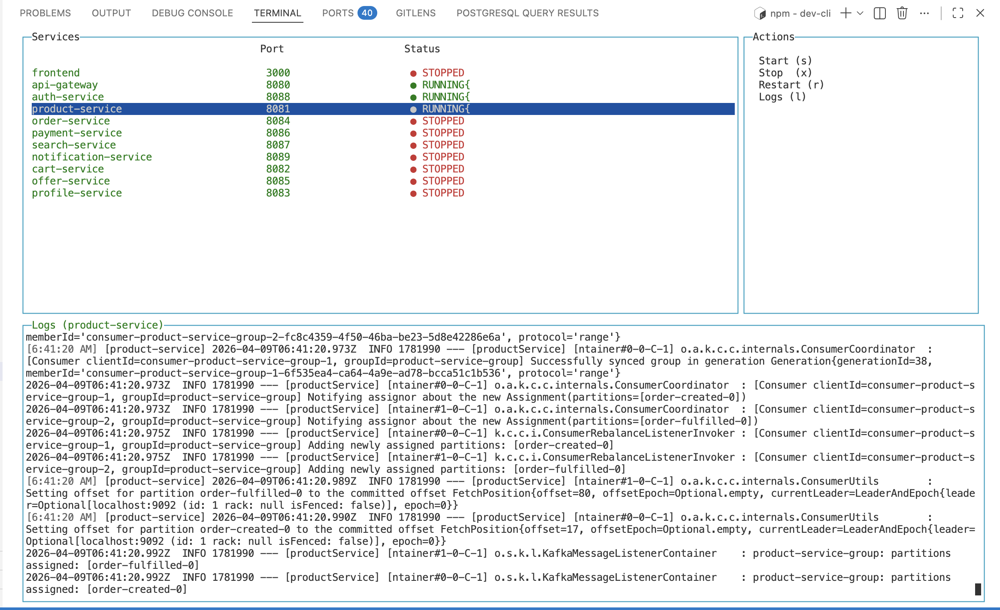

# 🚀 Dev CLI — Local Microservices Orchestrator

A modern terminal-based CLI tool to manage multiple microservices (Spring Boot + Next.js) from a single interface.

---

## ✨ Features

* 🟢 Start / Stop / Restart services
* 📊 Live service status (RUNNING / STOPPED)
* 📜 Real-time log streaming
* 🔍 Per-service log filtering
* 🎯 Keyboard-driven UI (like k9s / lazydocker)
* ⚡ Works with:

  * Spring Boot (Maven)
  * Next.js (Node)

---

## 🧱 Project Structure

```
src/
│
├── index.ts                # Entry point (orchestrates everything)
│
├── config/
│   └── services.ts        # All service definitions (paths, ports, commands)
│
├── types/
│   └── service.ts         # TypeScript types (Service, Process, etc.)
│
├── core/
│   ├── processManager.ts  # Start/Stop/Restart logic
│   ├── statusManager.ts   # Service status detection (port + process)
│   └── logManager.ts      # Log storage + filtering
│
├── ui/
│   ├── screen.ts          # Screen + layout setup
│   ├── servicesTable.ts   # Services panel UI
│   ├── logsPanel.ts       # Logs panel UI
│   └── keybindings.ts     # Keyboard controls
│
└── utils/
    └── logger.ts          # Logging formatter + integration
```

---

## 🧠 Architecture Overview

This CLI follows a clean separation of concerns:

| Layer    | Responsibility                         |
| -------- | -------------------------------------- |
| config   | What services exist                    |
| core     | Business logic (process, status, logs) |
| ui       | Rendering (terminal UI)                |
| utils    | Shared helpers                         |
| index.ts | Orchestrator (connects everything)     |

---

## ⚙️ Prerequisites

Make sure you have:

```bash
node >= 18
npm
java (for Spring Boot)
maven (mvn)
```

---

## 📦 Installation

```bash
npm install
```

---

## ▶️ Run the CLI

```bash
npx ts-node src/index.ts
```

---

## 🎮 Keyboard Controls

| Key   | Action                               |
| ----- | ------------------------------------ |
| ↑ / ↓ | Navigate services                    |
| s     | Start service                        |
| x     | Stop service                         |
| r     | Restart service                      |
| l     | Toggle logs (ALL / selected service) |
| q     | Quit CLI                             |

---

## 📊 UI Layout

```
-----------------------------------------
| Services (status)     | Actions        |
-----------------------------------------
| Logs (full width)                    |
-----------------------------------------
```



---

## 🧩 Services Configuration

Edit:

```
src/config/services.ts
```

Example:

```ts
{
  name: "product-service",
  type: "backend",
  path: ".../backend/productService",
  port: 8081,
  startCommand: "mvn spring-boot:run"
}
```

---

## 📜 Logs Behavior

* Logs are captured per service
* Default: show ALL logs
* Press `l` → filter logs for selected service

---

## 🔍 Status Detection

Service status is determined using:

1. Running process (primary)
2. Port check (fallback)

---

## ⚡ Notes

* `mvn spring-boot:run` compiles code but does NOT fully rebuild
* Frontend (`npm run dev`) is handled as a separate process
* Process groups are used to ensure proper killing (especially for Next.js)

---

## 🚀 Future Improvements

* 🔨 Build support (mvn clean install)
* 🔗 Dependency-based startup order
* ❤️ Health checks (Spring Actuator)
* 🔍 Log search & filtering
* ☸️ Kubernetes integration

---

## 🧑‍💻 Author

Built for improving local development workflow for multi-service systems.

---

## 💡 Inspiration

Inspired by:

* k9s
* lazydocker
* developer productivity tools

---

Enjoy faster and cleaner development 🚀
